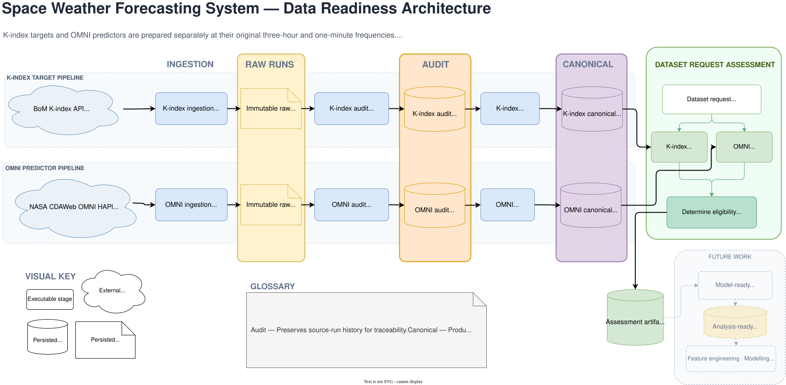

# K-index Prediction Data Readiness Pipeline

This project builds the data foundation for short-horizon prediction of the
Australian-region K-index. K-index observations are the future modelling
target, while minute-level solar-wind and interplanetary magnetic-field
observations from NASA's OMNI dataset are candidate predictors.

The completed MVP is not yet a forecasting model. It preserves source history,
reconciles observations, and determines whether the K-index targets, historical
K-index lags, and OMNI lookback windows required by a modelling request are
available and trustworthy. See the [project vision](docs/project-vision.md) for
the current scope and roadmap.

## System flow



K-index targets and OMNI predictors remain in separate pipelines at their
native three-hour and one-minute cadences. After each source has been audited
and reconciled into canonical observations, dataset assessment checks whether a
requested modelling period has the required target, lag, and lookback data.

## Data trust and readiness

1. **Raw provenance** preserves what each ingestion run returned instead of
   cleaning the response in place. See the
   [K-index ingestion contract](specs/spec-01-k-index.md) and
   [OMNI ingestion contract](specs/spec-05-ingest-omni-dataset.md).
2. **Auditability** retains run identifiers, empty successful responses,
   duplicates, source fills, and disagreements. See
   [K-index preprocessing](specs/spec-02-k-index-preproc.md) and
   [OMNI preprocessing](specs/spec-06-omni-preproc.md).
3. **Canonical reconciliation** produces one downstream observation per key
   without discarding quality or conflict information. The K-index rules are
   defined in its [preprocessing contract](specs/spec-02-k-index-preproc.md),
   while OMNI has a separate
   [canonical contract](specs/spec-07-omni-canonical.md).
4. **Coverage and eligibility** compare the expected target, lag, and predictor
   windows with canonical data, then return either readiness or contextual
   issues. See the [coverage contract](specs/spec-08-coverage-reporting.md),
   [assessment contract](specs/spec-09-dataset-assessment.md),
   [coverage implementation](src/coverage.py),
   [assessment implementation](src/dataset_assessment.py), and
   [contract tests](tests/coverage_reporting/).

## Explore the pipeline

The Streamlit dashboard presents a read-only walkthrough of the system
architecture, K-index lineage, OMNI lineage, one dataset assessment, and source
attribution. It reads committed, frozen demonstration artifacts; it does not
run ingestion or preprocessing, write artifacts, or make external requests.

Until a hosted dashboard is available, the frozen demonstration can be
launched locally using the commands below without API credentials. Its data-use
limitations and source attribution are documented below.

## Current status

- [x] K-index ingestion, audit, and canonical reconciliation
- [x] OMNI ingestion, audit, and canonical reconciliation
- [x] Native-cadence coverage and dataset-request eligibility
- [x] Contract tests and user-facing pipeline entrypoints
- [x] Read-only data-lineage and assessment dashboard
- [ ] Wide model-ready dataset construction
- [ ] Feature engineering
- [ ] Model development and evaluation
- [ ] Experiment tracking
- [ ] Prediction serving

## Running locally

Install the development dependencies and launch the credential-free dashboard
from the repository root:

```powershell
pip install -r requirements-dev.txt
python -m streamlit run dashboard/app.py
```

The interactive Windows
[coverage-reporting test menu](scripts/tests-coverage-reporting/test-dataset-assessment.cmd)
also runs without API credentials.

Live K-index ingestion is different: it requires a BoM Space Weather API key
provided through the uncommitted `SPACE_WEATHER_API_KEY` environment variable.
OMNI ingestion does not require that BoM credential. The editable ingestion,
audit, canonicalization, assessment, and test runners are available under
[`scripts/`](scripts/), but the dashboard itself only presents previously
generated artifacts.

## Data sources and attribution

The public dashboard uses frozen demonstration artifacts and does not make live
API requests. Its displayed numeric observations were modified and must not be
treated as historical measurements or used for scientific analysis or
operational forecasting.

- **K-index:** [Australian Bureau of Meteorology Space Weather API](https://sws-data.sws.bom.gov.au/api-docs). The API is the source of the response structure, field definitions, locations, and three-hour intervals demonstrated by the project. This repository does not claim a specific licence for observations returned by the API.
- **OMNI:** NASA Space Physics Data Facility (SPDF), [OMNI_HRO2_1MIN](https://cdaweb.gsfc.nasa.gov/misc/NotesO.html#OMNI_HRO2_1MIN), *OMNI Combined, Definitive 1-minute IMF and Definitive Plasma Data Time-Shifted to the Nose of the Earth's Bow Shock, plus Magnetic Indices*. [DOI: 10.48322/mj0k-fq60](https://doi.org/10.48322/mj0k-fq60). See also the [NASA SPDF data-use policy](https://spdf.gsfc.nasa.gov/data_use_policy.html).

One additional K-index record was deliberately constructed to demonstrate
conflict resolution. It was not supplied by the Bureau of Meteorology.
